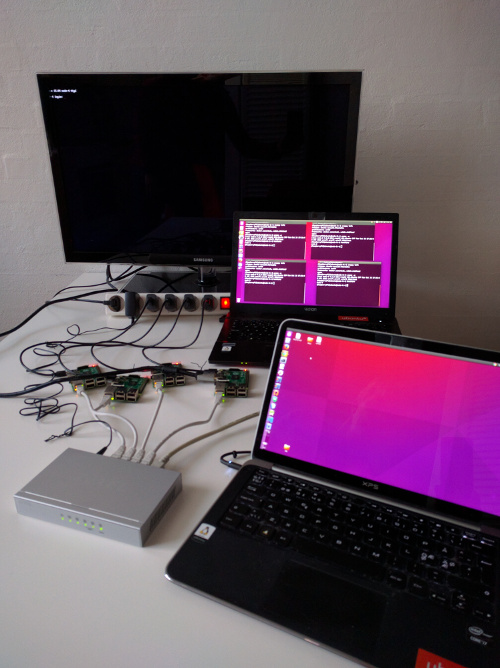
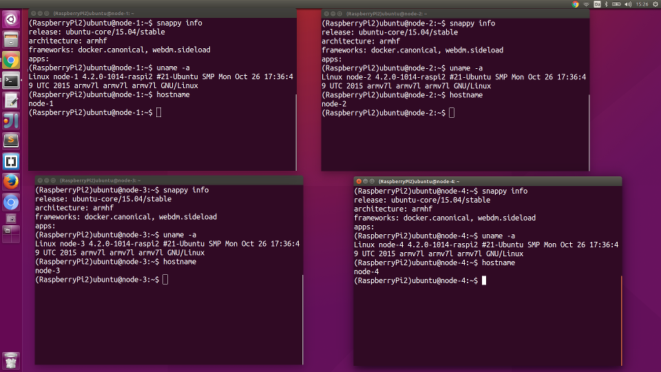
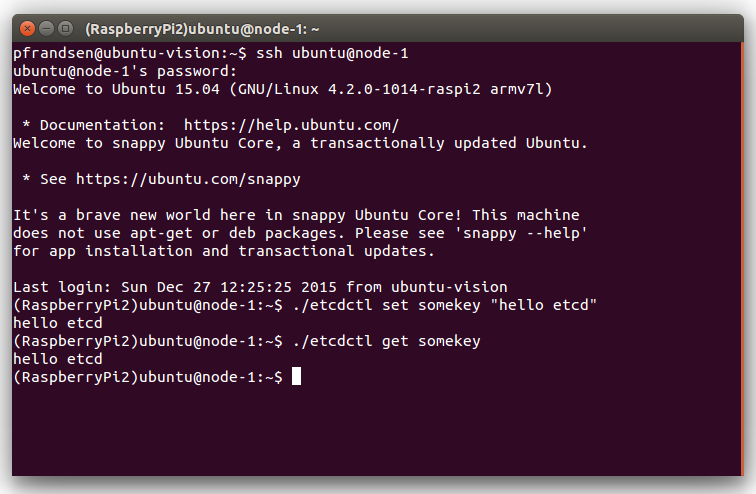
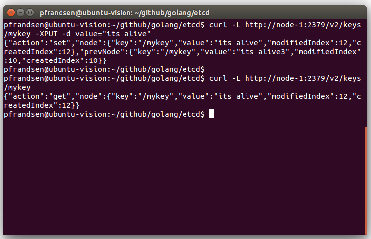

## Building a 4 node etcd cluster on Raspberry Pi using Snappy Ubuntu Core and Docker

This article describes how build and run a etcd cluster on Raspberry Pi. Snappy Ubuntu Core is used as the base OS on the Pi devices,
and it is shown how you can run a etcd cluster directly on the base OS and how to run it using Docker containers.

**Side note**: The article markdown source is generated with the following command (to embed source code):
```sh
go run build.go < etcd-cluster.src > etcd-cluster.md
```

### Hardware

The hardware used to build and configure the cluster consist of:

1. 4 x Raspberry Pi 2 Model B (32 bit Arm7, quad core, 900MHz, 1GB RAM)
2. 4 x 32GB microSD memory cards
3. 1 x 5 port switch
4. Network cables, Ubuntu Linux laptops, USB power adapters, microSD to USB adapter, ...

The main parts for the cluster is shown in the image below.


### Flash microSD cards with Snappy Ubuntu Core

First you need to download a Snappy image and write it to the sd memory cards. On your workstation/laptop do the following:
```sh
mkdir snappy
cd snappy
wget http://cdimage.ubuntu.com/ubuntu-snappy/15.04/stable/latest/ubuntu-15.04-snappy-armhf-raspi2.img.xz
sha256sum ubuntu-15.04-snappy-armhf-raspi2.img.xz
```

Check sha256 hash against file located at http://cdimage.ubuntu.com/ubuntu-snappy/15.04/stable/latest/ 

Insert memory card in usb slot and excute the following command:
```sh
sudo fdisk -l
```

This will list device ids. Find the one that match your memory card (it is most likely FAT32 formatted).

In my case the device id is sdb1 - replace sdb1 with your device id in the following commands:
```sh
umount /dev/sdb1
```

You can also unmount it from the file manager (you still need to get device id for writing the disk image to the memory card). Note the the number 1 in the device id is not included in the command to write the image to the sd card.
```sh
xzcat ubuntu-15.04-snappy-armhf-raspi2.img.xz | sudo dd of=/dev/sdb bs=32M
sync
```

Now run
```sh
sudo fdisk -l
```

and you sdcard device should look something like:
```sh
Device     Boot   Start     End Sectors  Size Id Type
/dev/sdb1  *       8192  270335  262144  128M  c W95 FAT32 (LBA)
/dev/sdb2        270336 2367487 2097152    1G 83 Linux
/dev/sdb3       2367488 4464639 2097152    1G 83 Linux
/dev/sdb4       4464640 7614463 3149824  1,5G 83 Linux
```

In the file manager these will be shown as writeable, system-a, system-b, and system-boot.

Repeat the above steps for the remaining three microSD cards.

Remove the sdcard (did you remember sync) and insert it into your Raspberry Pi and turn the power on. The first boot will take a minute or so.

If you have a keyboard attached you can login with username **ubuntu** and password **ubuntu**.

If you have a single Raspberry Pi connected to your network simply use:

```sh
ssh ubuntu@webdm.local
```
 
### Change hostname for Snappy image

I will use node-1, node-2, node-3, and node-4 as host names for the four devices. To rename the devices insert a sd card in each device and leave them in power off mode. Then follow the instructions below for each of them (powering up the devices one at a time).



To rename a Snappy image you need to edit two files:

1. /etc/hostname
2. /etc/hosts

The Snappy OS does not come with **Emacs** or **nano**, and I have not been able to find 'snap' packages for any of these, so
you will have to use **vi** to edit the files. If you are like me you will be lost in vi, so I will provide full instructions for
the keys you have to press to get the renaming done, and then just hope that you do not have to edit any other files.

Note: You can edit the files and save the changes, but I have not been able to 'edit' the files from the command line (probably
due to my limited knowledge about Snappy security). Else I would have used these commands to avoid vi ;-)
```sh
[sudo] echo "node-1" > /etc/hostname
echo -e "127.0.0.1\tlocalhost" > t; echo -e "127.0.1.1\tnode-1" >> t
tail -n+3 /etc/hosts >> t
[sudo| cat t > /etc/hosts
rm t
```

Power on the first device and edit /etc/hostname.

```sh
ssh ubuntu@webdm.local
ubuntu@localhost:~$ sudo vi /etc/hostname

press D to delete the current name (D = delete line)
press i to enter insert mode
write the new name (e.g., node-1)
press <esc>:wq<enter>
```

If anything goes wrong press &lt;esc&gt;:q! to quit without saving and start over (the escape key sets vi in command mode).

Displaying the hostname file should now print **node-1**.
```sh
ubuntu@localhost:~$ cat /etc/hostname 
node-1
```

Now edit /etc/hosts
```sh
ubuntu@localhost:~$ sudo vi /etc/hosts
press D to delete the first line in the file
press i to enter insert mode
type: 127.0.0.1<tab>localhost
press <esc> and use arrow keys to move to start of next line
press D
press i
type: 127.0.0.1<tab>node-1
press <esc>:wq
```

Displaying the hosts file should now print:
```sh
ubuntu@localhost:~$ cat /etc/hosts
127.0.0.1	localhost
127.0.1.1	node-1

# The following lines are desirable for IPv6 capable hosts
::1     localhost ip6-localhost ip6-loopback
fe00::0 ip6-localnet
ff02::1 ip6-allnodes
ff02::2 ip6-allrouters
ff02::3 ip6-allhosts
```

Reboot device
```sh
sudo shutdown -r now
```

When device have rebooted you can connect again using
```sh
ssh ubuntu@node-1
```

Repeat the process for the remaining three devices. When setting up the additional nodes you would likely need to issue the following command to clear the cached ssh key for webdm.local.
```sh
ssh-keygen -f ~/.ssh/known_hosts -R webdm.local
```

### Update Snappy and install Docker

See [A snappy tour of Ubuntu Core](https://developer.ubuntu.com/en/snappy/start/using-snappy/) for a brief introduction to Snappy.

To update the OS and install docker you simply do the following for each device
```sh
ssh ubuntu@node-1

ubuntu@node-1:~$ sudo snappy update ubuntu-core
ubuntu@node-1:~$ sudo snappy install docker
ubuntu@node-1:~$ snappy info
release: ubuntu-core/15.04/stable
architecture: armhf
frameworks: docker.canonical, webdm.sideload
apps: 
```

Repeat for node-2 - node-4.



### Optional step - testing connectivity (and playing with Go and cross compilation)

You should be able to connect to any port on the Snappy devices, given that there is a service listening on it. If you want to verify access on a given port you can check it with the sample web server shown below (source is on GitHub). Simply build the server with Go (1.5 or later), copy executable to device, run it, and test access via browser/curl/wget.

Build:
```sh
git clone https://github.com/pfrandsen/golang.git
cd golang/webserver/ping
./arm-build.sh
```

Copy ARM binary to node:
```sh
scp <filename> ubuntu@<node-name>:
scp server ubuntu@node-4:
```

Run it:
```sh
ssh ubuntu@node-4
./server -port=<port>
./server -port=8000
```

Access http://node-4:8000/info (http://&lt;node ip&gt;:8000/info) and you should see something like:


Web server source code:
```go
package main

import (
	"flag"
	"fmt"
	"io"
	"log"
	"net"
	"net/http"
	"os"
	"os/exec"
	"strconv"
	"unicode/utf8"
)

var listenPort int

func localIPs() string {
	addrs, err := net.InterfaceAddrs()
	if err != nil {
		return ""
	}
	ips := ""
	for _, address := range addrs {
		// check address type and if it is not a loopback then add it to result
		if ipnet, ok := address.(*net.IPNet); ok && !ipnet.IP.IsLoopback() {
			if ipnet.IP.To4() != nil {
				if utf8.RuneCountInString(ips) > 0 {
					ips = ips + ", "
				}
				ips = ips + ipnet.IP.String()
			}
		}
	}
	return ips
}

func uname() string {
	out, err := exec.Command("uname", "-a").Output()
	if err != nil {
		return "Unknown"
	}
	return string(out)
}

func lsb(field string) string {
	out, err := exec.Command("lsb_release", "-s", "-"+field).Output()
	if err != nil {
		return "Unknown"
	}
	return string(out)
}

func header(w http.ResponseWriter) {
	io.WriteString(w, "<html>\n")
	io.WriteString(w, "<head>\n")
	io.WriteString(w, "</head>\n")
	io.WriteString(w, "<body>\n")
}

func footer(w http.ResponseWriter) {
	io.WriteString(w, "</body>\n</html>\n")
	fmt.Fprintf(w, "</body>\n</html>\n")
}

func ping(w http.ResponseWriter, r *http.Request) {
	header(w)
	io.WriteString(w, "It's alive")
	footer(w)
}

func info(w http.ResponseWriter, r *http.Request) {
	host, _ := os.Hostname()
	header(w)
	io.WriteString(w, "<dl>")
	io.WriteString(w, "<dt>Hostname</dt><dd>"+host+"</dd>")
	io.WriteString(w, "<dt>Operating System</dt>")
	io.WriteString(w, "<dd><dl>")
	io.WriteString(w, "<dt>uname -a</dt><dd>"+uname()+"</dd>")
	io.WriteString(w, "<dt>lsb id</dt><dd>"+lsb("i")+"</dd>")
	io.WriteString(w, "<dt>lsb release</dt><dd>"+lsb("r")+"</dd>")
	io.WriteString(w, "<dt>lsb description</dt><dd>"+lsb("d")+"</dd>")
	io.WriteString(w, "<dt>lsb codename</dt><dd>"+lsb("c")+"</dd>")
	io.WriteString(w, "</dl></dd>")
	io.WriteString(w, "<dt>IP</dt><dd>"+localIPs()+"</dd>")
	io.WriteString(w, "<dt>Port</dt><dd>"+strconv.Itoa(listenPort)+"</dd>")
	io.WriteString(w, "<dt>Process id</dt><dd>"+strconv.Itoa(os.Getpid())+"</dd>")
	io.WriteString(w, "<dt>Parent process id</dt><dd>"+strconv.Itoa(os.Getppid())+"</dd>")
	io.WriteString(w, "<dt>User Agent</dt><dd>"+r.UserAgent()+"</dd>")
	io.WriteString(w, "</dl>")
	footer(w)
}

func main() {
	portPtr := flag.Int("port", 8000, "listen port")
	flag.Parse()
	listenPort = *portPtr
	http.HandleFunc("/info", info)
	http.HandleFunc("/", ping)
	fmt.Println("starting server, listening on port:", listenPort)
	err := http.ListenAndServe(":"+strconv.Itoa(listenPort), nil)
	if err != nil {
		log.Fatal("ListenAndServe: ", err)
	}
}
```

Build script:
```sh
#!/bin/bash

# Requires Go > 1.5 for cross compilation

export GOOS=linux
export GOARCH=arm
export GOARM=7

rm -f server
echo "Cross compiling sample webserver for $GOOS $GOARCH $GOARM"
go build server.go
```

### Tired of entering password for 4 devices?

If typing in the password each time you ssh into one of the devices makes your fingers hurt, you can run this script to get it over
with once and for all (remove .ssh folder in /home/ubuntu on each device to reanable password).
```sh
#!/bin/bash

DEVICENAMES="node-1 node-2 node-3 node-4"
echo "type <enter> to each question (y for overwrite)"
ssh-keygen -t rsa
ssh-add
for device in $DEVICENAMES; do
    ssh-copy-id ubuntu@$device
done
```

### etcd
etcd, which is part of [CoreOS](https://en.wikipedia.org/wiki/CoreOS "CoreOS Wikipedia article") is a daemon that runs across the nodes in a cluster to provides a distributed key-value store. It is often used for
reliably distributing configuration information (e.g., [Kubernetes](https://en.wikipedia.org/wiki/Kubernetes "Kubernetes Wikipedia article") depends on etcd). It will be used here as the "sample" service to test out the Raspberry Pi cluster.

#### Building and testing etcd

You can clone the etcd git repository from github (git clone https://github.com/coreos/etcd.git) and build the latest source, but these are not guaranteed to be stable. Instead we will use the latest release from https://github.com/coreos/etcd/releases/ - at the time this guide was written it is version 2.2.2.

A build script is provided on github (https://github.com/pfrandsen/golang/blob/master/etcd/build.sh). 
```sh
#!/bin/bash

# Requires Go > 1.5 for cross compilation

ARM=false
SRC_DIR=src
ETCD_VERSION=2.2.2 # See https://github.com/coreos/etcd/releases/ for the latest release
USAGE_SHORT="[-v=$ETCD_VERSION] [-d=$SRC_DIR] [-a]"
USAGE_LONG="[--version=$ETCD_VERSION] [--directory=$SRC_DIR] [--arm]"

# handle script arguments
for i in "$@"
do
case $i in
    -h|--help)
    echo "usage: $0 $USAGE_SHORT"
    echo "usage: $0 $USAGE_LONG"
    echo -e "\nall arguments are optional"
    echo "default values for source version and target directory are shown above"
    echo "if arm flag is present the source will be cross compiled for ARM architecture"
    exit 0
    ;;
    -v=*|--version=*)
    ETCD_VERSION="${i#*=}"
    ;;
    -d=*|--directory=*)
    SRC_DIR="${i#*=}"
    ;;
    -a|--arm)
    ARM=true
    ;;
    *)
            # unknown option
    ;;
esac
done

if [ -d "$SRC_DIR" ]; then
    echo "Error: Source directory '$SRC_DIR' already exists"  >&2
    exit 1
fi

if [ "$ARM" = "true" ]
then
  export GOOS=linux
  export GOARCH=arm
  export GOARM=7
  echo "cross compiling etcd $ETCD_VERSION for $GOOS $GOARCH $GOARM"
else
  echo "compiling etcd $ETCD_VERSION for default OS and architecture"
fi

mkdir $SRC_DIR
echo "fetching etcd source and unpacking in $SRC_DIR directory"
curl -sSL -k https://github.com/coreos/etcd/archive/v${ETCD_VERSION}.tar.gz | tar --touch --directory $SRC_DIR -xz
pushd $SRC_DIR/etcd-${ETCD_VERSION} > /dev/null 2>&1

# etcd build script likes to have the source in a git repo in order to generate sha hash (git rev-parse --short HEAD)
echo "converting "`pwd`" to git repo"
git init > /dev/null 2>&1
git add . > /dev/null 2>&1
git commit -m "etcd ${ETCD_VERSION} source" > /dev/null 2>&1
echo "building etcd and etcdclt ..."
./build
echo "binaries can be found in "`pwd`"/bin"
popd > /dev/null 2>&1

```

Like the [web server](#optional-step---testing-connectivity-and-playing-with-go-and-cross-compilation) above, the build can be done on
your laptop using the cross compilation capabilities of the Go compiler.

To build and test this on a Raspberry Pi do the following.

Build ARM binaries:
```sh
git clone https://github.com/pfrandsen/golang.git
cd golang/etcd
./build.sh --arm --version=2.2.2
```

Copy ARM binaries to node:
```sh
scp src/etcd-2.2.2/bin/etcd ubuntu@node-1:
scp src/etcd-2.2.2/bin/etcdctl ubuntu@node-1:
```

Run etcd service:
```sh
ssh ubuntu@node-1
./etcd
```

To test it open another terminal and run:
```sh
ssh ubuntu@node-1
./etcdctl set somekey "hello etcd"
./etcdctl get somekey
```

The output should look like:


##### Accessing etcd over the network
When the etcd server is started as shown in the previous section it is not accessible from remote hosts. To enable network access the etcd server needs to be configured (via **listen-client-urls** parameter) to listen on the meta address 0.0.0.0. When this address is used etcd will listens to the given port on all interfaces. The parameter **advertise-client-urls** must also be set when listen-client-urls are set.


The golang github repository used previously contains a bash script that can be used to configure network access. It is placed in the same folder (golang/etcd) as the script to build etcd. It is also included here for convinience.
```sh
#!/bin/bash

# use hostname in advertise client urls
NODE_NAME="etcd-"`hostname`
LCU="http://0.0.0.0:2379,http://0.0.0.0:4001"
ACU="http://"`hostname`":2379,http://"`hostname`":4001"
./etcd -name $NODE_NAME -listen-client-urls $LCU -advertise-client-urls $ACU

```


Copy script to node:
```sh
[git clone https://github.com/pfrandsen/golang.git]
[cd golang/etcd]
scp run-single.sh ubuntu@node-1:
```

Run etcd service:
```sh
ssh ubuntu@node-1
./run-single.sh
```

To test it from a network client open another terminal and run:
```sh
curl -L http://node-1:2379/v2/keys/mykey -XPUT -d value="its alive"
curl -L http://node-1:2379/v2/keys/mykey
```

The output from the etcd client should look like:



<!-- 

[text](link "Title")
```sh
```
-->


```dockerfile
FROM resin/rpi-raspbian:wheezy-20151223
MAINTAINER Peter Frandsen <pfrandsen@gmail.com>
LABEL decription="Raspberry Pi etcd (32 bit ARM)"

COPY etcd /etcd/etcd
COPY etcdctl /etcd/etcdctl

RUN chmod +x /etcd/etcd
RUN chmod +x /etcd/etcdctl

ENV PATH "$PATH:/etcd"
# RUN echo $PATH

EXPOSE 4001 7001 2379 2380
```


