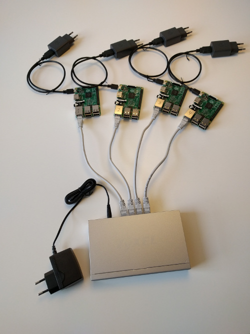

## Building a 4 node etcd cluster on Raspberry Pi using Snappy Ubuntu Core and Docker

This article describes how build and run a etcd cluster on Raspberry Pi. Snappy Ubuntu Core is used as the base OS on the Pi devices,
and it is shown how you can run a etcd cluster directly on the base OS and how to run it using Docker containers.

Side note: The article markdown source is generated with the following command (to embed source code):
```sh
go run build.go < etcd-cluster.src > etcd-cluster.md
```

### Hardware

The hardware used to build and configure the cluster consist of:

1. 4 x Raspberry Pi 2 Model B (32 bit Arm7, quad core, 900MHz, 1GB Ram)
2. 4 x 32GB microSD memory cards
3. 1 x 5 port switch
4. Network cables, Ubuntu Linux laptops, USB power adapters, microSD to USB adapter, ...

The main parts for the cluster is shown in the image below.



### Flash microSD cards with Snappy Ubuntu Core

First you need to download a Snappy image and write it to a sd memory card. On your workstation/laptop do the following:
```sh
mkdir snappy
cd snappy
wget http://cdimage.ubuntu.com/ubuntu-snappy/15.04/stable/latest/ubuntu-15.04-snappy-armhf-raspi2.img.xz
sha256sum ubuntu-15.04-snappy-armhf-raspi2.img.xz
```

Check sha256 hash against file located at http://cdimage.ubuntu.com/ubuntu-snappy/15.04/stable/latest/ 

Insert memory card in usb slot and excute the following command:
```sh
sudo fdisk -l
```

This will list device ids. Find the one that match your memory card (it is most likely FAT32 formatted).

In my case the device id is sdb1 - replace sdb1 with your device id in the following commands:
```sh
umount /dev/sdb1
```

You can also unmount it from the file manager (you still need to get device id for writing the disk image to the memory card). Note the the number 1 in the device id is not included in the command to write the image to the sd card.
```sh
xzcat ubuntu-15.04-snappy-armhf-raspi2.img.xz | sudo dd of=/dev/sdb bs=32M
sync
```

Now run
```sh
sudo fdisk -l
```

and you sdcard device should look something like:
```sh
Device     Boot   Start     End Sectors  Size Id Type
/dev/sdb1  *       8192  270335  262144  128M  c W95 FAT32 (LBA)
/dev/sdb2        270336 2367487 2097152    1G 83 Linux
/dev/sdb3       2367488 4464639 2097152    1G 83 Linux
/dev/sdb4       4464640 7614463 3149824  1,5G 83 Linux
```

In the file manager these will be shown as writeable, system-a, system-b, and system-boot.

```dockerfile
FROM resin/rpi-raspbian:wheezy-20151223
MAINTAINER Peter Frandsen <pfrandsen@gmail.com>
LABEL decription="Raspberry Pi etcd (32 bit ARM)"

COPY etcd /etcd/etcd
COPY etcdctl /etcd/etcdctl

RUN chmod +x /etcd/etcd
RUN chmod +x /etcd/etcdctl

ENV PATH "$PATH:/etcd"
# RUN echo $PATH

EXPOSE 4001 7001 2379 2380
```


