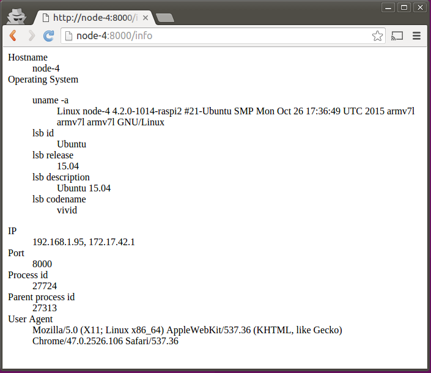

#Sample web server#
This web server is used as part of a Raspberry Pi project. In that project it is used to check connectivity on specific ports and to get basic info about the device/os. The server only responds to two context paths "/" and "/info".

This application uses Linux commands and will therefor only work as intende on Linux systems.

##Build and run##
1. ./build.sh (or go build static.go) - use ./arm-build.sh if building for ARM processor (e.g., Raspberry Pi)
2. ./server -port=&lt;port&gt; 

Default port is 8000.

Example run command:
* **./server -port=8080**

Point browser to [http://localhost:8080/](http://localhost:8080/) or [http://localhost:8080/info](http://localhost:8080/info). Use hostname or ip address of Raspberry Pi device when running server on the device. 

Sample output from running the server on a Raspberry Pi named node-4 (running Snappy Ubuntu Core)

